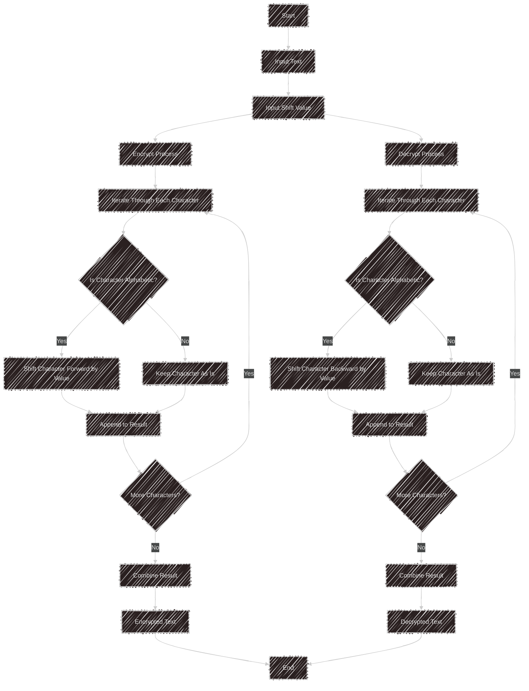

# Caesar Cipher Encryption

This project provides a Python program to encrypt and decrypt text using the **Caesar cipher**. This cipher is a substitution method where each letter is replaced by another located a fixed distance away in the alphabet.

----------

## Features

-   Encrypt text with a specified shift.
    
-   Decrypt text that has been previously encrypted.
    
-   Simple command-line interface.
    

----------

## Prerequisites

-   Python 3 or higher.
    

----------

## Installation

1.  Clone the repository:
    

```
git clone https://github.com/malic1tus/caesar-cipher
```

2.  Navigate to the directory:
    

```
cd caesar-cipher
```

----------

## Usage

1.  Run the program:
    

```
python caesar_cipher.py
```

2.  Follow the terminal instructions to:
    
    -   Encrypt text.
        
    -   Decrypt text.
        
    -   Exit the program.
        

### Example:

#### Encryption:

-   Input: `Hello World`
    
-   Shift: `3`
    
-   Output: `Khoor Zruog`
    

#### Decryption:

-   Input: `Khoor Zruog`
    
-   Shift: `3`
    
-   Output: `Hello World`
    

----------

## Project Structure

-   `caesar_cipher.py`: Contains the main code for encryption and decryption.
    

----------

## Flowchart

Below is a flowchart representing how the Caesar cipher encryption works:



----------

## Contribution

Contributions are welcome!

1.  Fork the repository.
    
2.  Create a branch: `git checkout -b feature-new-functionality`
    
3.  Make your changes.
    
4.  Push your changes: `git push origin feature-new-functionality`
    
5.  Create a Pull Request.
    

----------

## License

This project is licensed under the MIT License. See the `LICENSE` file for details.